# Claude Code, 업무별로 쓸 만한 스킬·플러그인

기획·디자인·퍼블리싱·프론트엔드·문서·마케팅 업무 기준. 여러 곳에서 반복 추천되고 평가가 좋은 것 위주. (2026-09 기준 · 공식 문서: https://code.claude.com/docs)

---

## 0. 용어 5개

스킬·플러그인·MCP·훅·컨텍스트 다섯 개. 이것만 알면 문서가 읽히고 도구 고르는 기준도 보입니다.

| 용어 | 뜻 | 팁 |
|---|---|---|
| **스킬** | Claude에게 일하는 방법을 적어 둔 지침. 필요할 때 자동으로 읽힘 | 평소엔 짧은 설명만 읽어 가벼움 |
| **플러그인** | 스킬·명령·훅·MCP를 한 번에 설치하는 패키지 | `/plugin install 이름@마켓` (마켓 = 플러그인 배포 목록) |
| **MCP** | Claude를 외부 서비스(Figma·Notion·브라우저 등)와 연결하는 서버 | 켜 두는 것만으로 토큰을 차지. 꼭 필요한 것만 |
| **훅(Hooks)** | 특정 시점에 자동 실행되는 스크립트(작은 프로그램) | 말로 한 지시와 달리 매번 확실히 실행됨 |
| **컨텍스트·토큰** | 컨텍스트 = Claude가 한 번에 기억하는 양, 토큰 = 그 단위(= 비용) | 도구를 많이 켤수록 대화에 쓸 공간이 줄고 비용이 늘어남 |

---

## 1. 시작하기 A–Z

유료 플랜(Pro 이상) 필요. 막히면 단계 아래 **안 될 때**를 보세요.  
`PS C:\…>`는 PowerShell 창, `>`는 Claude에게 치는 말, `⏺`는 Claude의 답.

> **터미널이 낯설다면** [데스크톱 앱](https://claude.com/download) 설치 → 로그인 → '폴더 열기'로 바로 시작. A–E는 익숙해진 뒤에.

### A. PowerShell 열기

`Win` 키 → `powershell` 입력 → **Windows PowerShell**. 창 맨 앞이 `PS`로 시작하면 맞습니다. **(x86)** 항목은 고르지 마세요.

### B. 설치 · 확인

① 설치 명령을 붙여넣고(`Ctrl`+`V`) Enter. `PS` 줄이 다시 보이면 끝.

```powershell
irm https://claude.ai/install.ps1 | iex
```

② **창을 닫고 새로 열어** 확인. `2.1.263 (Claude Code)`처럼 버전이 나오면 성공.

```powershell
claude --version
```

**안 될 때**

| 오류 문구 | 해결 |
|---|---|
| 'claude' 용어가 … 인식되지 않습니다 (is not recognized) | 창을 모두 닫고 새로 열기. 그래도 같으면 `[Environment]::SetEnvironmentVariable('PATH', [Environment]::GetEnvironmentVariable('PATH', 'User') + ";$env:USERPROFILE\.local\bin", 'User')` 실행(아무것도 안 나오면 정상) 후 새 창에서 다시 |
| 'irm'은(는) … 명령이 아닙니다 · '&&' 토큰 · 'fsSL' 매개 변수 (not recognized · not a valid statement separator · parameter name 'fsSL') | 다른 창(CMD)이거나 다른 OS용 명령입니다. PowerShell 창에서 위 설치 명령을 그대로 복사해 다시 |
| SSL/TLS 보안 채널 · 기본 연결이 닫혔습니다 (SSL/TLS secure channel · connection was closed) | `[Net.ServicePointManager]::SecurityProtocol = 'Tls12'; irm https://claude.ai/install.ps1 \| iex`. 회사망이면 IT 담당자에게 `downloads.claude.ai` 허용 요청 |
| 회사망에서 원격 서버에 연결할 수 없습니다 (Unable to connect to the remote server) | 회사 프록시를 거쳐야 하는 경우. IT 담당자에게 받은 주소로 `$p = 'http://프록시주소:포트'; [Environment]::SetEnvironmentVariable('HTTPS_PROXY', $p, 'User'); $env:HTTP_PROXY = $p; $env:HTTPS_PROXY = $p; irm https://claude.ai/install.ps1 | iex`. 이후 Claude 실행에도 계속 적용 |
| `<html` 같은 글자가 섞인 오류 · 403 | 잠시 뒤 다시. 계속되면 `winget install Anthropic.ClaudeCode`(자동 업데이트 없음) |

그 밖의 오류는 [공식 문제 해결](https://code.claude.com/docs/en/troubleshoot-install)에서 문구로 찾기.

### C. 첫 실행 · 로그인

① Claude에게 맡길 파일이 있는 폴더(없으면 새 폴더)를 탐색기로 열고, 주소창에 `powershell` → Enter. 열린 창에서 `claude` 실행.

<details>
<summary>그림으로 보기</summary>



</details>

② 처음 한 번만 묻는 것: 테마(Enter) → 로그인 방식 **Claude account with subscription** → 브라우저에서 로그인·승인 → 창으로 돌아와 Enter → 이 폴더를 신뢰하는지(**Yes**).

③ `>` 입력창이 보이면 성공. 첫 명령 `/init`으로 Claude가 매번 읽는 메모(CLAUDE.md)를 만드세요. 끝낼 때는 `/exit`.

```text
# Windows PowerShell — 첫 실행 · /init
PS C:\work\my-project> claude
Opening browser to log in...   (처음 한 번만)
> 이 폴더에 뭐가 있는지 설명해줘
⏺ React 관리자 화면 프로젝트입니다. 화면은 src/pages, 기획 문서는 docs/ ...
> /init
⏺ Write(CLAUDE.md)
⏺ CLAUDE.md를 만들었어요. 빌드 명령 · 폴더 구조 · 코딩 규칙을 적어 두었습니다.
```

**안 될 때**

| 증상 · 오류 문구 | 해결 |
|---|---|
| 브라우저가 안 열림 | 창에서 `c`를 눌러 주소를 복사해 브라우저에 붙여넣기 |
| 브라우저에 코드가 보임 · Paste code here | 코드를 복사해 창에 붙여넣고 Enter. `Ctrl`+`V`가 안 되면 마우스 오른쪽 클릭 |
| 403 Forbidden · 사용 권한 없음 | 무료 플랜이거나 구독이 끝났습니다. [claude.ai/settings](https://claude.ai/settings)에서 확인 |
| This organization has been disabled | 예전에 넣은 API 키가 구독 대신 쓰이는 중. `[Environment]::SetEnvironmentVariable('ANTHROPIC_API_KEY', $null, 'User')` 후 새 창에서 다시 |

### D. Node.js · Python 설치

E의 스킬·MCP 설치(`npx`)와 문서 스킬용. Claude를 끝낸(`/exit`) PowerShell 창에서 실행하고, 설치 허용 창이 뜨면 **예**. 끝나면 창을 새로 열어 `node -v`로 확인. Claude 자체에는 필요 없으니 막히면 건너뛰어도 됩니다.

```powershell
winget install OpenJS.NodeJS.LTS --accept-source-agreements --accept-package-agreements
winget install Python.Python.3.12 --accept-source-agreements --accept-package-agreements
```

**안 될 때**

| 증상 · 오류 문구 | 해결 |
|---|---|
| 'node'·'npx' 용어가 … 인식되지 않습니다 | 창을 모두 닫고 새로 열기 |
| 스크립트를 실행할 수 없으므로 … npx.ps1 (running scripts is disabled) | `Set-ExecutionPolicy RemoteSigned -Scope CurrentUser`(묻으면 `Y`). 회사 정책으로 막히면 `npx` 대신 `npx.cmd` |
| 'winget' 용어가 … 인식되지 않습니다 · 관리자 권한 요구 | 사이트에서 설치 파일로(권한이 막히면 IT 담당자에게 요청): [Node.js](https://nodejs.org/ko/download) · [Python](https://www.python.org/downloads/)(첫 화면에서 Add python.exe to PATH 체크) |

### E. 플러그인 · MCP · 스킬 붙이기

① 플러그인은 Claude 대화창에서. 설치 후 다시 시작하라고 하면 `/exit` → `claude`.

```text
/plugin install skill-creator@claude-plugins-official
/plugin install mattpocock-skills@claude-plugins-official
```

② 스킬·MCP는 PowerShell에서. `Ok to proceed?`에는 `y`, 설치 위치 등을 물으면 그대로 Enter. 아래는 필요한 스킬을 말로 찾아 주는 find-skills이고, 다른 도구는 4–5장 표의 '설치' 칸에 있습니다.

```powershell
npx skills add vercel-labs/skills --skill find-skills
```

> 세팅 추천: `/plugin install claude-code-setup@claude-plugins-official` 후 "이 프로젝트에 맞는 자동화 추천해줘". 프로젝트에 맞는 훅·스킬·MCP를 골라 줍니다.

### 자주 쓰는 명령 한눈에

| 명령 | 무엇 |
|---|---|
| `claude "작업"` · `claude -p "질문"` | 첫 지시와 함께 시작 · 한 번 답하고 종료 |
| `claude -c` · `claude -r` | 직전 세션(대화 한 판) 이어가기 · 이전 세션 고르기 |
| `/help` · `/model` · `/exit` | 명령 목록 · 모델 변경 · 종료 |
| `/plugin` · `/mcp` · `/permissions` | 플러그인 탐색 · MCP 상태 · 권한 설정 |
| `/cost` · `/rewind` · `/resume` | 토큰·비용 확인 · 체크포인트(자동 저장 지점)로 되감기(`Esc` 두 번과 같음) · 이전 세션 이어가기 |
| `/security-review` | 변경한 코드의 보안 점검. 설치 없이 바로 |
| `/statusline` | 입력창 아래 상태 표시줄 설정. 모델·컨텍스트·플랜 사용량을 상시 표시(아래 예). 한 번 설정하면 이후 자동. 더 풍부하게는 [claude-hud](https://github.com/jarrodwatts/claude-hud) |

> 상태 표시줄 예: `Fable 5.1 · effort high · ctx 185k/1M 18% · 5h 24% · 7d 41% · my-project`  
> `ctx`는 이 세션이 쓴 컨텍스트(기억 용량), `5h`·`7d`는 5시간·7일 플랜 사용량(Pro·Max). 80%를 넘으면 초기화 시각이 붙습니다.

---

## 2. 터미널 쉽게 쓰기

제목을 누르면 펼쳐집니다. Windows 기준, 맥은 마지막. `필수` 표시 6개만 익혀도 충분합니다.

<details>
<summary><b>A. Windows Terminal</b> — 새 탭 `Ctrl+Shift+T` · 화면 나누기 `Alt+Shift+D` · 복사 · 붙여넣기</summary>

| 하는 일 | 키 | 메모 |
|---|---|---|
| 새 탭 | `Ctrl+Shift+T` | 프로젝트 폴더마다 탭 하나 |
| 탭 전환 | `Ctrl+Tab` |  |
| 탭 닫기 | `Ctrl+Shift+W` | 나눈 창에서는 포커스된 창만 닫힘 |
| 화면 나누기 | `Alt+Shift+D` | 지금 창을 복제해 넓은 쪽으로 나눔 |
| 나눈 창 이동 | `Alt+←→↑↓` |  |
| 나눈 창 크기 조절 | `Alt+Shift+←→↑↓` |  |
| 검색 | `Ctrl+Shift+F` |  |
| 화면 맨 위로 | `Ctrl+Shift+Home` | 지난 출력 처음까지 |
| 화면 맨 아래로 | `Ctrl+Shift+End` | 입력줄로 복귀 |
| 한 화면 위로 | `Ctrl+Shift+PgUp` |  |
| 한 화면 아래로 | `Ctrl+Shift+PgDn` |  |
| 글자 키우기 | `Ctrl+=` |  |
| 글자 줄이기 | `Ctrl+-` |  |
| 복사 | 드래그 후 `Ctrl+C` |  |
| 붙여넣기 | `Ctrl+V` |  |
| 명령 팔레트 | `Ctrl+Shift+P` | 모든 동작 검색 |
| 퀵 창 | `Win+`` | 화면 위에서 내려오는 터미널 |
| 키 바꾸기 | `Ctrl+,` | 설정 → 동작에서 변경 |

> 추천 배치: 화면을 나눠(`Alt+Shift+D`) 왼쪽은 작업, 오른쪽은 질문용 `claude`. 프로젝트가 여럿이면 탭.

</details>

```text
# Windows PowerShell — 왼쪽 창: 작업하는 세션
PS C:\work\my-project> claude
> 가입 화면에 카카오 로그인 추가해줘
⏺ Update(src/LoginForm.tsx)
⏺ Update(src/auth.ts)
⏺ Write(src/kakao.ts)
```

```text
# Windows PowerShell — 오른쪽 창: 물어보는 세션 (Alt+Shift+D 로 열기)
PS C:\work\design-system> claude
> Figma MCP는 어떻게 연결해?
⏺ /plugin install figma@claude-plugins-official 한 줄이면 됩니다.
```

<details>
<summary><b>B. PowerShell 창에서</b> — 폴더에서 바로 열기 · `Tab` 자동 완성 · `Esc` 지우기 · `Ctrl+R` 검색 · 자주 쓰는 명령 5</summary>

| 하는 일 | 키 | 메모 |
|---|---|---|
| 자동 완성 | `Tab` | 여러 번 누르면 후보 순환 |
| 완성 목록 보기 | `Ctrl+Space` | 후보를 메뉴로 보고 고르기 |
| 이전 명령 검색 | `Ctrl+R` | 일부만 쳐도 찾아 줌 |
| 앞글자 맞는 이전 명령 | `F8` | `cd`까지 치고 누르면 cd로 시작한 명령만 |
| 입력 줄 지우기 | `Esc` |  |
| 줄 처음으로 | `Home` |  |
| 줄 끝으로 | `End` |  |
| 단어 왼쪽으로 | `Ctrl+←` |  |
| 단어 오른쪽으로 | `Ctrl+→` |  |
| 단어 하나 지우기 | `Ctrl+Backspace` |  |
| 화면 지우기 | `Ctrl+L` | `cls`와 같음 |
| 되돌리기 | `Ctrl+Z` | 입력 편집 취소 |
| 여러 줄 명령 | `Shift+Enter` | PowerShell 창에서는 됨 (Claude 안에서는 Ctrl+J) |
| 경로 넣기 | 탐색기에서 폴더를 창으로 드래그 | 경로가 그대로 붙음 |
| 이 폴더에서 터미널 열기 | 탐색기 주소창에 `powershell` 입력 후 Enter | `cd` 없이 그 폴더에서 바로 열림. `wt`를 치면 Windows Terminal. 빈 곳 `Shift+우클릭` → "터미널에서 열기"도 같음 |

**자주 쓰는 명령 다섯 개**

| 명령 | 무엇 |
|---|---|
| `cd 폴더` · `cd ..` | 폴더로 이동 · 상위로 |
| `ls` · `pwd` | 목록 보기 · 현재 위치 |
| `code .` · `explorer .` | 현재 폴더를 VS Code · 탐색기로 열기 |
| `cls` | 화면 지우기 |
| `claude` | 여기서 Claude Code 시작 |

</details>

<details>
<summary><b>C. VS Code 안에서</b> — `Ctrl+`` 터미널 열기 · `Ctrl+Shift+5` 나누기</summary>

| 하는 일 | 키 | 메모 |
|---|---|---|
| 터미널 열기 · 닫기 | `Ctrl+`` | 같은 키로 토글 |
| 새 터미널 | `Ctrl+Shift+`` |  |
| 터미널 나누기 | `Ctrl+Shift+5` | 나눈 창 이동은 `Alt+←` `Alt+→` |
| Claude Code 패널 | Spark 아이콘 클릭 | 확장 설치 후 오른쪽 패널 |

</details>

<details open>
<summary><b>D. Claude Code 세션 안에서</b> — `필수` 6개 포함 · `Esc` · `Shift+Tab` · `Ctrl+J` · `Alt+V`</summary>

| 하는 일 | 키 | 메모 |
|---|---|---|
| 단축키 도움말 | `?` | 빈 입력창에서 누르면 모든 단축키가 뜸 |
| 답변 멈추기 `필수` | `Esc` |  |
| 되감기 `필수` | `Esc` 두 번 | 이전 지점으로 돌아가 다시 시도 |
| 입력 지우기 · 중단 | `Ctrl+C` | 입력 중이면 지우기, 실행 중이면 중단. PowerShell 창에서도 같음 |
| 종료 | `Ctrl+D` |  |
| 여러 줄 입력 `필수` | `Ctrl+J` | Enter는 전송, 줄바꿈은 Ctrl+J. 안 되면 줄 끝에 `\` 치고 Enter |
| 이전 입력 | `↑` | PowerShell 창에서도 같음 |
| 권한 모드 전환 `필수` | `Shift+Tab` | Manual → acceptEdits → Plan → auto 순환. 모드 설명은 3장 |
| 이미지 붙이기 `필수` | `Alt+V` | 스크린샷 복사 후 바로. 파일 드래그도 됨 |
| 대화 맨 위로 | `Ctrl+Home` | 전체화면 모드에서. 마우스 휠도 됨 |
| 대화 맨 아래로 | `Ctrl+End` | 최신 답변으로 복귀 |
| 반 화면 위로 | `PgUp` |  |
| 반 화면 아래로 | `PgDn` |  |
| 모델 전환 | `Alt+P` |  |
| 명령 실행 `필수` | `/` | 명령 · 스킬 목록 |
| 셸 명령 그대로 실행 | `!` | 예: `!git status` |
| 파일 언급 | `@` | 예: `@src/App.tsx` |

</details>

```text
# 세션 안에서 자주 쓰는 동작
# Shift+Tab → 아래 안내줄이 바뀜
▸▸ plan mode on (shift+tab to cycle) · ? for shortcuts
# Ctrl+J → 여러 줄 입력
> 결제 화면 개편 계획 세워줘
  - 카드 · 카카오페이 지원
  - 기존 주문 데이터 유지
⏺ 계획만 정리했습니다. 파일은 수정하지 않았어요. 진행할까요?
# Alt+V → 스크린샷 붙이기
> [Image #1] 이 화면 왜 깨졌어?
⏺ flex-wrap 이 없어 좁은 폭에서 넘칩니다. 고칠까요?
```

<details>
<summary><b>E. 맥이라면</b> — iTerm2 나누기 `Cmd+D` · Option을 Meta로</summary>

| 하는 일 | 키 | 메모 |
|---|---|---|
| iTerm2 화면 나누기 | `Cmd+D` | 가로는 `Cmd+Shift+D`. 새 탭은 `Cmd+T` |
| Alt 단축키 쓰기 | 터미널 설정에서 Option → Meta | `Alt+P` 같은 키를 쓰려면 필요 |
| 이미지 붙이기 | `Ctrl+V` | iTerm2는 `Cmd+V` |

</details>

---

## 3. 권한 모드와 습관

Claude가 어디까지 스스로 하게 둘지 정하는 권한 모드와, 대화 공간(컨텍스트)을 아끼는 습관. 처음엔 기본 Manual로 쓰고, 계획만 받고 싶을 때 Plan.

### 권한 모드 6가지 (주로 `Shift+Tab`으로 전환)

| 모드 | 동작 | 언제 |
|---|---|---|
| **Manual** (default) | 도구별 첫 사용 시 확인 창(↑↓로 고르고 Enter 허용 · Esc 거부) | 하나씩 확인받고 싶을 때 |
| **acceptEdits** | 파일 편집 자동 승인 | 평소 작업. 확인 창 줄이기 |
| **Plan** | 파일 수정 없이 읽기·계획 | 시작 전 계획 세울 때 |
| **auto** | 안전 검사 후 자동 승인 | Pro·Max·Team에서 사용 가능. 긴 작업 맡길 때 |
| **dontAsk** | 허용 목록 외 자동 거부 | 고급. 명령줄 옵션으로만 켬(Shift+Tab엔 없음) |
| **bypassPermissions** (`claude --dangerously-skip-permissions`) | 확인 없이 전부 실행 | 고급. 내 PC와 분리된 가상 환경(컨테이너·VM)에서만. 먼저 hookify(4장)로 위험 명령 차단 |

### 습관 4개

| 항목 | 무엇 |
|---|---|
| `/context` | 무엇이 토큰을 얼마나 쓰는지 확인. MCP가 크게 차지하면 `/mcp`에서 끄기 |
| `/clear` · `/compact` | 작업이 바뀌면 clear(대화 기억 비우기), 대화가 길어지면 compact(요약해 줄이기) |
| CLAUDE.md 짧게 | `/init`으로 만들고 200줄 미만. 매번 읽히므로 길면 토큰 낭비 |
| `/handoff` | 세션이 길어지면 인수인계 문서 생성. 새 세션에 붙여넣으면 이어짐. mattpocock-skills에 포함 |

---

## 4. 핵심 요약 — 이것만 알아도 됨

누구나 먼저 설치할 6개. 요구사항 검증·스킬 찾기·안전장치·CLAUDE.md 관리. 업무별 도구는 5장.

`필수` = 누구나 · `핵심` = 업무별 기본 · `/이름` = 직접 호출 · 자동 = 설치만 하면 말로 시킬 때 알아서 쓰임.  
설치 명령이 `/`로 시작하면 Claude 대화창(`>`)에, 그 외(`npx`·`npm`·`pip` 등)는 PowerShell 창(`PS>`)에 입력.

| 항목 | 용도 | 호출 · 사용법 | 설치 |
|---|---|---|---|
| **[skill-creator](https://claude.com/plugins/skill-creator)** `필수` (공식) · 플러그인 | 반복 지시를 스킬로 | **`/skill-creator`** 지시를 설명하면 파일 생성 | `/plugin install skill-creator@claude-plugins-official` |
| **[grill-me](https://github.com/mattpocock/skills/blob/main/skills/productivity/grill-me/SKILL.md)** `필수` · 스킬 | 시작 전 요구사항 검증 | **`/grill-me`** 하고 싶은 일을 말하면 질문으로 검증 | `/plugin install mattpocock-skills@claude-plugins-official` |
| **[find-skills](https://github.com/vercel-labs/skills/blob/main/skills/find-skills/SKILL.md)** `필수` · 스킬 | 필요한 스킬 검색·설치 | **자동** "PDF 다루는 스킬 있어?" | `npx skills add vercel-labs/skills --skill find-skills` |
| **[security-guidance](https://claude.com/plugins/security-guidance)** `필수` (공식) · 플러그인 | 비밀키·취약 코드 경고 | **자동** Python 설치 후. 편집 시 경고 | `/plugin install security-guidance@claude-plugins-official` |
| **[hookify](https://claude.com/plugins/hookify)** `필수` (공식) · 플러그인 | 훅 생성: 위험 명령 차단·종료 전 검사 | **`/hookify`** "삭제 명령 막아줘"처럼 말하면 훅 생성 | `/plugin install hookify@claude-plugins-official` |
| **[claude-md-management](https://claude.com/plugins/claude-md-management)** `필수` (공식) · 플러그인 | 세션 학습을 CLAUDE.md에 반영 | **`/revise-claude-md`** 세션 끝에 실행. 점검은 "CLAUDE.md 감사해줘" | `/plugin install claude-md-management@claude-plugins-official` |

> 원칙: 적게 설치(MCP 3~6, 스킬 8~12). 명령으로 되면 MCP 대신 스킬·CLI(터미널 명령 도구).

---

## 5. 업무별 도구

기획·디자인·퍼블리싱·문서(마케팅 포함) 중 내 업무 탭만. `핵심` 표시가 먼저 설치할 것. 공통 도구는 4장.

> 준비물: 문서 스킬(기획·문서 탭)은 Python·LibreOffice·Poppler가 있어야 파일이 만들어집니다. Python은 1장 D에서, LibreOffice·Poppler는 문서 스킬 README(항목 링크) 참고.

### 기획

요구사항을 질문으로 확정하고 스펙·티켓·기획서로 만드는 도구.

| 항목 | 용도 | 호출 · 사용법 | 설치 |
|---|---|---|---|
| **[grill-me](https://github.com/mattpocock/skills/blob/main/skills/productivity/grill-me/SKILL.md)** `필수` · 스킬 | 질문으로 요구사항 확정 | **`/grill-me`** 하고 싶은 일을 말하면 질문으로 검증 | `/plugin install mattpocock-skills@claude-plugins-official` |
| **[to-spec · to-tickets](https://github.com/mattpocock/skills/blob/main/skills/engineering/to-spec/SKILL.md)** · 스킬 | 요구사항 → 스펙·티켓(Jira 등 작업 항목) | **`/to-spec` · `/to-tickets`** grill 뒤에 실행. 티켓 게시는 `/setup-matt-pocock-skills` 먼저 | `/plugin install mattpocock-skills@claude-plugins-official` |
| **[문서 스킬](https://github.com/anthropics/skills#readme)** `핵심` (pptx·docx) · 스킬 | 기획서·제안서 생성 | **자동** "이 내용으로 PPT 만들어줘" | `/plugin marketplace add anthropics/skills` 후 `/plugin install document-skills@anthropic-agent-skills` |
| **[Notion MCP](https://claude.com/plugins/notion)** (공식) · MCP | Notion 읽기·쓰기 | **자동** 첫 사용 전 `/mcp` → 이름 선택 → Authenticate(브라우저 로그인). "Notion 기획 페이지 요약해줘" | `/plugin install notion@claude-plugins-official` |

### 디자인

Figma에서 코드까지. 결과물이 평범해지지 않게 잡아 주는 도구.

| 항목 | 용도 | 호출 · 사용법 | 설치 |
|---|---|---|---|
| **[frontend-design](https://claude.com/plugins/frontend-design)** `핵심` (공식) · 플러그인 | "AI 티" 나는 화면 방지 | **자동** UI 작업이면 자동 적용 | `/plugin install frontend-design@claude-plugins-official` |
| **[Figma MCP](https://claude.com/plugins/figma)** `핵심` (공식) · MCP | Figma → 코드·스타일 변수 | **자동** 첫 사용 전 `/mcp` → 이름 선택 → Authenticate(브라우저 로그인). 링크 붙여넣고 "코드로 만들어줘" | `/plugin install figma@claude-plugins-official` |
| **[design-taste-frontend](https://github.com/Leonxlnx/taste-skill/blob/main/skills/taste-skill/SKILL.md)** · 스킬 | 디자인 취향 보정 | **자동** 디자인 작업 시 자동 | `npx skills add Leonxlnx/taste-skill --skill design-taste-frontend` |
| **[animate](https://github.com/emilkowalski/skills/blob/main/skills/animate/SKILL.md)** · 스킬 | 애니메이션 설계 | **자동** "호버 애니메이션 넣어줘" | `npx skills add emilkowalski/skills` |
| **[apple-design](https://github.com/emilkowalski/skills/blob/main/skills/apple-design/SKILL.md)** · 스킬 | Apple식 모션·타이포 | **자동** "Apple 느낌 모션으로" | 위와 같은 저장소 |
| **[ui-ux-pro-max](https://github.com/nextlevelbuilder/ui-ux-pro-max-skill)** · 플러그인 | 팔레트·서체·UX 규칙 검색 | **자동** 디자인 작업 시 자동. frontend-design과 둘 중 하나만 | `/plugin marketplace add nextlevelbuilder/ui-ux-pro-max-skill` 후 `/plugin install ui-ux-pro-max@ui-ux-pro-max-skill` |

> 회사 디자인 시스템이 있으면 CLAUDE.md에 그 규칙(토큰·컴포넌트 경로)을 적어 두세요. Claude가 매번 읽고 기준으로 삼습니다.

### 퍼블리싱 · 프론트엔드

최신 문서 참조·화면 검증·타입과 성능 규칙.

| 항목 | 용도 | 호출 · 사용법 | 설치 |
|---|---|---|---|
| **[Context7](https://github.com/upstash/context7)** `핵심` · MCP | 최신 문서 참조 | **자동** 라이브러리 질문 시 자동. 질문 끝에 "use context7"을 붙이면 강제 | `npx ctx7 setup` (API 키 발급 · MCP 등록 자동) |
| **[agent-browser](https://github.com/vercel-labs/agent-browser)** `핵심` · 스킬 · CLI | 브라우저로 화면 직접 확인 | **자동** "localhost:3000(내 PC에서 띄운 화면 주소) 열어서 확인해줘" | `npm i -g agent-browser` → `agent-browser install` → `npx skills add vercel-labs/agent-browser` (한 줄씩) |
| **[web-design-guidelines](https://github.com/vercel-labs/agent-skills/blob/main/skills/web-design-guidelines/SKILL.md)** (Vercel) · 스킬 | 접근성·UX 감사 | **자동** "접근성 기준으로 검토해줘" | `npx skills add vercel-labs/agent-skills` |
| **[react-best-practices](https://github.com/vercel-labs/agent-skills/blob/main/skills/react-best-practices/SKILL.md)** (Vercel) · 스킬 | React 성능 규칙 | **자동** React 작성 시 자동 | 위와 같은 저장소 |
| **[pick-ui-library](https://github.com/emilkowalski/skills/blob/main/skills/pick-ui-library/SKILL.md)** · 스킬 | UI 라이브러리 추천 | **`/pick-ui-library`** 요구를 말하면 라이브러리 1개 추천 | `npx skills add emilkowalski/skills` |
| **[typescript-lsp](https://claude.com/plugins/typescript-lsp)** (공식) · 플러그인 | 타입 오류 자동 확인(LSP = 코드 분석 서버) | **자동** 편집할 때마다 자동 | `npm i -g typescript-language-server typescript` 후 `/plugin install typescript-lsp@claude-plugins-official` |

### 문서 · 업무

워드·PPT·엑셀·PDF와 Notion, 문체 정리.

| 항목 | 용도 | 호출 · 사용법 | 설치 |
|---|---|---|---|
| **[문서 스킬](https://github.com/anthropics/skills#readme)** `핵심` (docx·pptx·xlsx·pdf) · 스킬 | 워드·PPT·엑셀·PDF | **자동** "이 내용으로 PPT 만들어줘" | `/plugin marketplace add anthropics/skills` 후 `/plugin install document-skills@anthropic-agent-skills` |
| **[humanizer](https://github.com/blader/humanizer)** `핵심` · 스킬 | AI 문체 제거 | **`/humanizer`** 글을 붙여넣고 실행 | `npx skills add blader/humanizer` |
| **[Notion MCP](https://claude.com/plugins/notion)** (공식) · MCP | Notion 연동 | **자동** 첫 사용 전 `/mcp` → 이름 선택 → Authenticate(브라우저 로그인). "Notion 기획 페이지 요약해줘" | `/plugin install notion@claude-plugins-official` |
| **[marketingskills](https://github.com/coreyhaines31/marketingskills)** · 스킬 | 마케팅·SEO 스킬 묶음 | **자동** "이 페이지 SEO 감사해줘" | `npx skills add coreyhaines31/marketingskills --skill seo-audit` (필요한 것만) |

---

## 6. 활용 예시

앞 장의 도구를 하루 업무 네 장면으로 조합했습니다.

설치한 플러그인·스킬은 `/이름`으로 직접 부르거나(장면 1), 말만 하면 알아서 쓰입니다(장면 2~4).

### 1. 요구사항 확정 → 스펙 → 티켓

만들 것을 한 줄로 말하면 Claude가 질문으로 빈 곳을 채운 뒤 스펙 문서와 작업 티켓을 만듭니다. `/grill-me`로 시작해 답만 하면 됩니다(플러그인 mattpocock-skills).

```text
# Windows PowerShell — 요구사항 → 스펙 → 티켓
> /grill-me 회원가입 화면을 개편하려고 해
⏺ 확인할게요. 1) 소셜 로그인 포함?  2) 기존 데이터 유지?  3) 완료 기준은?
> 1) 카카오만  2) 유지  3) 가입 완료율 측정
⏺ 범위 정리: 카카오 로그인 추가 · 데이터 유지 · 완료율 이벤트 로깅
> /to-spec
⏺ Write(docs/spec.md)
> /to-tickets
⏺ 티켓 9개로 나눴습니다. 각 티켓에 수용 기준 포함.
```

### 2. 디자인 → 코드

Figma에서 컴포넌트 링크를 복사(우클릭 → 링크 복사)해 붙여넣으면 코드로 만듭니다(플러그인 figma). 지킬 규칙은 "우리 변수로"처럼 한 문장만 덧붙입니다.

```text
# Windows PowerShell — 디자인 → 코드
> https://www.figma.com/design/xxxx?node-id=12-345 이 컴포넌트를 우리 색·간격 변수로 코드화해줘
⏺ figma - get_design_context(node 12-345)
⏺ Write(src/components/Button.tsx)
⏺ Write(src/components/button.scss)
⏺ 색·간격을 변수(--color-primary, --space-3)에 맞췄습니다.
```

### 3. 화면 검증

Claude가 브라우저를 열어 화면을 눌러 보고 스크린샷으로 보여 줍니다(스킬 agent-browser). 배포된 사이트 주소도 됩니다. "접근성 기준으로"처럼 관점을 말하면 그 기준으로 검토합니다(스킬 web-design-guidelines).

```text
# Windows PowerShell — 화면 검증
> localhost:3000 열어서 가입 버튼 눌러보고 스크린샷 찍어줘
⏺ Bash(agent-browser open http://localhost:3000 && click "가입")
⏺ 클릭 후 완료 화면이 뜹니다. [Image] signup-done.png
> 접근성 기준으로 검토해줘
⏺ 3가지: 버튼 대비 부족(4.2:1) · 입력창 라벨 누락 · 포커스 표시 없음. 고칠까요?
```

### 4. 문서 업무와 마무리

PDF·엑셀·PPT는 파일 이름과 원하는 결과만 말하면 됩니다(플러그인 document-skills, 준비물은 5장 문서 탭). git(변경 이력 관리 도구)을 쓰는 폴더라면 마지막에 "커밋해줘"로 변경을 기록합니다. 안 쓰면 건너뛰세요.

```text
# Windows PowerShell — 문서 업무와 마무리
> report.pdf 요약해서 엑셀 표로 만들어줘
⏺ Read(report.pdf)
⏺ Write(summary.xlsx)
⏺ 핵심 항목 24개를 summary.xlsx 로 저장했습니다.
> 변경한 파일 커밋해줘
⏺ Bash(git add -A && git commit -m "docs: 보고서 요약 엑셀 추가")
⏺ 커밋했습니다.
```

> 팁: "로그인 버그 고쳐줘"보다 "비밀번호 틀리면 빈 화면 뜨는 버그 고쳐줘"처럼 구체적으로. 마음에 안 들면 "왜 그렇게 했어?" 또는 `Esc` 두 번으로 되감기.

---

## 7. 워크플로 · 토큰 절약

작업 절차를 잡아 주는 도구와 토큰을 아끼는 도구. 코드 작업이 많거나 작업이 길 때 필요한 것만 고르세요. 처음이라면 건너뛰어도 됩니다.

| 항목 | 용도 | 호출 · 사용법 | 설치 |
|---|---|---|---|
| **[superpowers](https://github.com/obra/superpowers)** · 플러그인 | 브레인스토밍 → 계획 → TDD(테스트 먼저 쓰기) → 검증 절차 강제 | **자동** 설치하면 작업마다 절차를 밟음. 토큰·시간을 더 씀 | `/plugin install superpowers@claude-plugins-official` |
| **[systematic-debugging](https://github.com/obra/superpowers/blob/main/skills/systematic-debugging/SKILL.md)** · 스킬 | 원인부터 찾는 디버깅 | **자동** 버그 보고 시 자동 | `npx skills add obra/superpowers --skill systematic-debugging` (전체는 위 superpowers) |
| **[code-review](https://claude.com/plugins/code-review)** (공식) · 플러그인 | PR(코드 변경 검토 요청)을 에이전트 4개가 병렬로 심층 리뷰 | **`/code-review`** PR 올린 뒤 실행. 내장 명령보다 깊게 봄 | `/plugin install code-review@claude-plugins-official` |
| **[gstack](https://github.com/garrytan/gstack)** · 스킬 묶음 | 리뷰·QA·배포까지 40개+ 스킬 | **`/review` `/qa` `/ship` 등** 설치 후 `/`로 목록 확인 | Git Bash(Git 설치 시 딸려오는 터미널) 창에서 `git clone --depth 1 https://github.com/garrytan/gstack.git ~/.claude/skills/gstack && cd ~/.claude/skills/gstack && ./setup` (PowerShell에선 안 됨 · Git·Bun(JS 실행기) 필요) |
| **[open-gsd](https://github.com/open-gsd/gsd-core)** · 도구 | 며칠 걸리는 프로젝트를 계획 → 실행 → 검증으로 | **`/gsd-new-project` · `/gsd-onboard`** 새 프로젝트·기존 코드 | `npx @opengsd/gsd-core@latest` |
| **loop · schedule** (내장) · 스킬 | 반복 실행·예약 실행 | **`/loop` · `/schedule`** `/loop 5m /명령`은 5분마다 반복, `/schedule`은 크론(시각·주기) 예약 | 내장. 설치 불필요 |
| **[context-mode](https://github.com/mksglu/context-mode)** · 플러그인 | 도구 실행 결과를 따로 보관해 토큰 절약 | **자동** 설치하면 자동 | `/plugin marketplace add mksglu/context-mode` 후 `/plugin install context-mode@context-mode` |
| **[RTK](https://github.com/rtk-ai/rtk)** · 도구 | 터미널 출력 압축으로 토큰 절약 | **자동** `rtk init -g` 한 번 실행 | Releases의 Windows zip을 풀어 `C:\Users\<이름>\.local\bin`(claude.exe와 같은 폴더)에 넣기 |
| **[Ponytail](https://github.com/DietrichGebert/ponytail)** · 스킬 | 코드를 짧게 유지 | **자동** 코드 작성 시 자동. `/ponytail off`로 해제 | `/plugin marketplace add DietrichGebert/ponytail` 후 `/plugin install ponytail@ponytail` |
| **[graphify](https://github.com/Graphify-Labs/graphify)** · 스킬 | 코드·문서를 지식 그래프로 파악 | **`/graphify .`** 프로젝트나 문서 폴더에서 실행 | `pip install graphifyy` 후 `graphify install` (Python 3.10+) |

> 끄기·지우기: 플러그인 `/plugin uninstall 이름` · MCP `claude mcp remove 이름` · 스킬은 `C:\Users\<이름>\.claude\skills\이름`(프로젝트 전용이면 프로젝트 안 `.claude\skills\이름`) 폴더 삭제.

---

## 8. Anthropic 공식 스킬·플러그인

Anthropic 공식 마켓·저장소 중 이 문서 업무에 맞는 것만. 앞 장에 이미 있는 항목은 제외.

| 항목 | 용도 | 호출 · 사용법 | 설치 |
|---|---|---|---|
| **[commit-commands](https://claude.com/plugins/commit-commands)** (공식) · 플러그인 · 퍼블리싱 · 프론트엔드 | 커밋·푸시·PR 한 번에 | **`/commit` · `/commit-push-pr`** 작업 끝에 실행. PR은 `gh`(GitHub 명령 도구) 로그인 필요 | `/plugin install commit-commands@claude-plugins-official` |
| **[webapp-testing](https://github.com/anthropics/skills/blob/main/skills/webapp-testing/SKILL.md)** · 스킬 · 퍼블리싱 · 프론트엔드 | 로컬 웹앱 Playwright 테스트 | **자동** Python 설치 후 `pip install playwright`·`playwright install`, 그다음 "이 페이지 테스트해줘" | example-skills (아래 설치) |
| **[web-artifacts-builder](https://github.com/anthropics/skills/blob/main/skills/web-artifacts-builder/SKILL.md)** · 스킬 · 퍼블리싱 · 프론트엔드 | React 앱을 HTML 한 파일로 | **자동** "React로 만들어서 HTML 하나로 묶어줘" | example-skills |
| **[brand-guidelines](https://github.com/anthropics/skills/blob/main/skills/brand-guidelines/SKILL.md)** · 스킬 · 디자인 | Anthropic 브랜드 적용 예제 | **자동** 자사 브랜드는 SKILL.md 복사 후 색·서체 교체 | example-skills |
| **[doc-coauthoring](https://github.com/anthropics/skills/blob/main/skills/doc-coauthoring/SKILL.md)** · 스킬 · 문서 · 업무 | 제안서·스펙 공동 작성 | **자동** "제안서 같이 써 줘" | example-skills |
| **[internal-comms](https://github.com/anthropics/skills/blob/main/skills/internal-comms/SKILL.md)** · 스킬 · 문서 · 업무 | 사내 공지·보고 형식 | **자동** 예제 양식 기준. 자사 양식은 SKILL.md 수정 | example-skills |

> example-skills 설치: `/plugin marketplace add anthropics/skills` 후 `/plugin install example-skills@anthropic-agent-skills`

---

## 9. 스킬 직접 만들기

스킬은 SKILL.md 한 파일. `/skill-creator`에게 말로 시키거나 아래처럼 직접 만듭니다.

1. **폴더 만들고 메모장 열기.** PowerShell을 새로 열면 바로 `C:\Users\<이름>` 위치입니다. 메모장이 새 파일을 만들지 물으면 **예**.
   ```powershell
   mkdir .claude\skills\meeting-notes
   notepad .claude\skills\meeting-notes\SKILL.md
   ```
2. **내용 붙여넣고 저장.** `---` 줄까지 그대로. `description`에는 "언제 쓰는지"를 적습니다. Claude가 스킬을 고르는 기준입니다.
   ```text
   ---
   name: meeting-notes
   description: 회의 메모를 결정 사항 · 할 일 · 다음 안건 형식의 회의록으로 정리한다
   ---
   결정 사항 → 할 일(담당자 · 기한) → 다음 안건 순으로 개조식 정리. 한국어.
   ```

> 바로 사용: Claude 대화창에서 `/meeting-notes`. 목록에 안 보이면 Claude를 다시 시작. `C:\Users\<이름>\.claude\skills\`에 두면 모든 폴더에서, `프로젝트\.claude\skills\`에 두면 그 프로젝트에서만 쓰입니다.

---

## 10. 비권장 · 비효율

평가가 나쁘거나, 토큰에 비해 효과가 낮거나, 내장 기능과 겹치는 것. 이미 쓰고 있을 때만 "대신" 열을 보세요.

| 항목 | 판정 | 이유 | 대신 |
|---|---|---|---|
| **[GitHub MCP](https://github.com/github/github-mcp-server)** · MCP | 비효율 | 도구 85개 이상을 불러와 토큰 낭비. `gh`(GitHub 명령 도구)로 대부분 대체 | `gh` 명령 |
| **[Playwright MCP](https://github.com/microsoft/playwright-mcp)** · MCP | 비효율 | 도구 50개 이상. Microsoft도 코딩 에이전트엔 CLI 권장 | agent-browser · Playwright CLI |
| **[Sequential Thinking MCP](https://github.com/modelcontextprotocol/servers/tree/main/src/sequentialthinking)** · MCP | 비권장 | 내장 기능으로 충분 | Plan 모드 |
| **[Serena MCP](https://github.com/oraios/serena)** · MCP | 비권장 | 공식 LSP 플러그인 등장. 보안 이슈 제기 이력 | typescript-lsp |
| **[caveman](https://github.com/JuliusBrussee/caveman)** · 스킬 | 비효율 | 벤치마크에서 "간단히 답해"와 차이 없음 | 적게 설치 · `/context` |
| **[mcproxy](https://github.com/team-attention/mcproxy)** · 도구 | 비권장 | 2026-01 이후 업데이트 없음. 내장 기능(MCP Tool Search)이 대신함 | MCP Tool Search |
| **[claude-mem](https://github.com/thedotmack/claude-mem)** · 플러그인 | 비효율 | 사용 한도를 빨리 쓰고 자주 오류 | CLAUDE.md · git 기록 |
| **[code-simplifier](https://claude.com/plugins/code-simplifier)** (공식) · 플러그인 | 비효율 | 내장 명령과 중복 | 내장 `/simplify` |
| **[headroom](https://github.com/headroomlabs-ai/headroom)** · 도구 | 비효율 | 프록시(중간 중계 서버)·라이브러리 방식이라 설정이 무거움 | RTK(7장) |

---

## 11. 부록 — 터미널 대체·보조

기본은 Windows Terminal(2장)·데스크톱 앱(1장). 여러 세션이나 미리보기가 필요할 때만 고릅니다.

| 항목 | 용도 | 호출 · 사용법 | 설치 |
|---|---|---|---|
| **[Orca](https://www.onorca.dev)** · 도구 | Claude Code 전용 작업 창. 세션 여러 개를 나란히 돌리고, 내장 브라우저·에디터와 휴대폰 앱으로 진행 확인 | **앱** 프로젝트 열기 → 에이전트로 Claude Code 선택. 기존 로그인을 자동 인식 | [onorca.dev/download](https://www.onorca.dev/download). Claude Code는 미리 설치·로그인(1장). 무료·오픈소스 · Win·Mac·Linux |
| **[Warp](https://www.warp.dev)** · 도구 | AI 터미널. 명령·출력이 블록으로 나뉘고 자동완성·오류 설명 | **터미널** 열고 `claude` 그대로 실행 | [warp.dev/download](https://www.warp.dev/download). 계정 가입 필요 · Windows 지원 |
| **[Wave Terminal](https://www.waveterm.dev)** · 도구 | 오픈소스 블록형 터미널. 옆 칸에 파일 미리보기·브라우저를 띄워 놓고 작업 | **터미널** 열고 `claude` 실행. 옆 칸에 파일·URL 열어 두기 | [waveterm.dev](https://www.waveterm.dev). 무료·오픈소스 · Windows 지원 |
| **[Ghostty](https://ghostty.org)** · 도구 | 빠르고 가벼운 터미널. Mac·Linux에서 인기 | **터미널** Windows는 공식 미지원(2026-09 기준) | Mac·Linux만. Windows는 Windows Terminal(2장) |

> 고르는 기준: 세션 하나면 Windows Terminal. 여러 세션·원격 확인은 Orca. 출력만 보기 좋게 하려면 Warp·Wave. 어느 쪽이든 로그인과 설치한 스킬·MCP는 그대로 이어서 씁니다.

---

© 2026 soonupy. All rights reserved. · [공식 문서 code.claude.com/docs](https://code.claude.com/docs/en/overview) · 2026-09 기준
